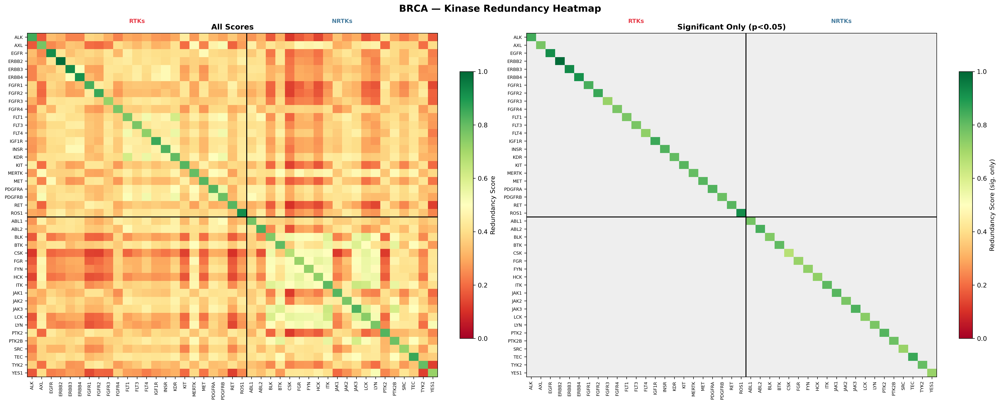
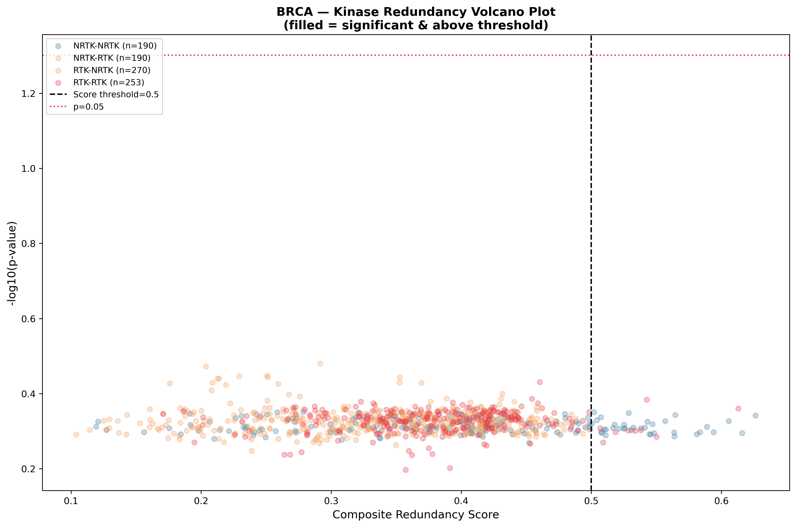
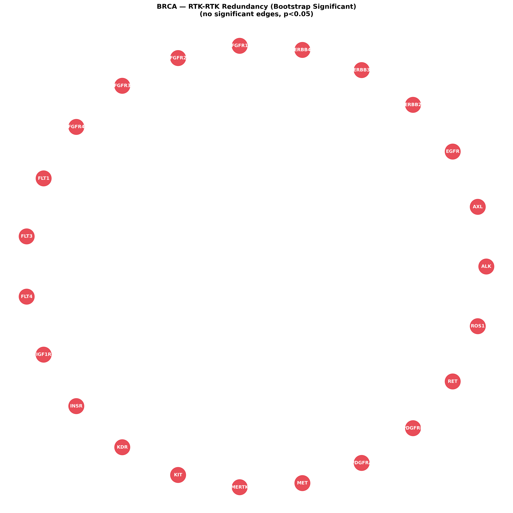
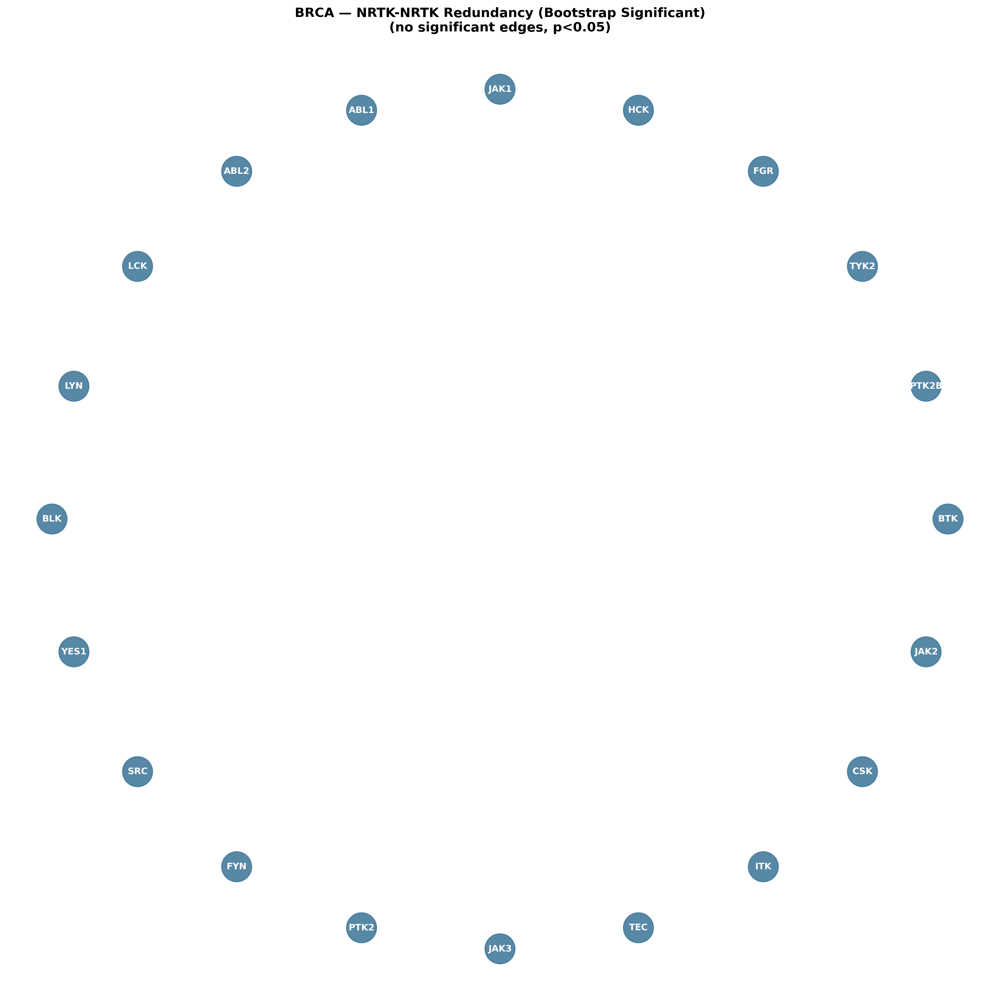
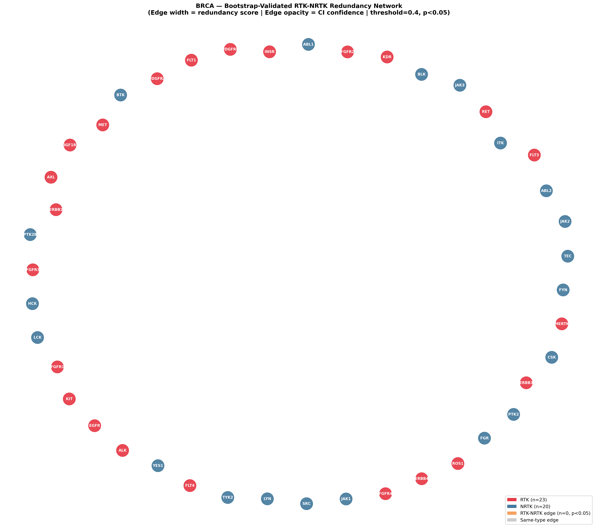
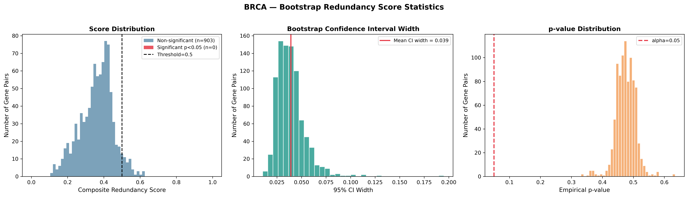

<div align="center">

<!-- BANNER -->


<!-- BADGES ROW 1 — Status -->
[](https://github.com/mtariqi/brca-kinase-redundancy)
[](LICENSE)
[](https://github.com/mtariqi/brca-kinase-redundancy/commits/main)
[](https://github.com/mtariqi/brca-kinase-redundancy)

<!-- BADGES ROW 2 — Languages & Tools -->
[](https://www.python.org/)
[](https://pytorch.org/)
[](https://docs.docker.com/compose/)
[](https://sqlite.org/)

<!-- BADGES ROW 3 — Infrastructure -->
[](https://nifi.apache.org/)
[](https://doris.apache.org/)
[](https://qdrant.tech/)
[](https://fishshell.com/)

<!-- BADGES ROW 4 — Data & Science -->
[](https://portal.gdc.cancer.gov/)
[](https://portal.gdc.cancer.gov/)
[-ff69b4?style=for-the-badge&logo=molecule&logoColor=white)](https://github.com/mtariqi/brca-kinase-redundancy)
[](https://github.com/mtariqi/brca-kinase-redundancy)

<!-- BADGES ROW 5 — Libraries -->
[](https://numpy.org/)
[](https://pandas.pydata.org/)
[](https://scikit-learn.org/)
[](https://matplotlib.org/)
[](https://networkx.org/)

</div>

---

## 🧬 Overview

> **Kinase redundancy** is a primary driver of therapeutic resistance in breast cancer. When one kinase is inhibited, a functionally redundant kinase compensates — sustaining oncogenic signalling. This pipeline **systematically quantifies** that redundancy across the full tyrosine kinome.

<div align="center">

```
TCGA-BRCA (1,082 samples · 43 kinases)
              │
    ┌─────────┼─────────┐
    ▼         ▼         ▼
 ESM-2     Pearson    Fisher
Sequence  Co-express  Mutation
Embedding  Pearson   Co-occur
    │         │         │
    └─────────┼─────────┘
              ▼
     Composite Redundancy Score
              │
    ┌─────────┼──────────┐
    ▼         ▼          ▼
Bootstrap  Network     PCA
  95% CI   Graphs   Analysis
```

</div>

---

## 🏗️ Infrastructure Architecture

```
┌─────────────────────────────────────────────────────────┐
│                    Docker Compose                        │
│                                                         │
│  ┌──────────────┐  ┌──────────────┐  ┌──────────────┐  │
│  │ Apache NiFi  │  │Apache Doris  │  │   Qdrant     │  │
│  │   (ETL)      │→ │  (OLAP DB)   │  │ (Vector DB)  │  │
│  │  Port 8443   │  │  Port 9030   │  │  Port 6333   │  │
│  └──────────────┘  └──────────────┘  └──────────────┘  │
│          │                │                  │          │
│          └────────────────┼──────────────────┘          │
│                           ▼                             │
│              ┌─────────────────────┐                    │
│              │  Python Pipeline    │                    │
│              │  brca_pipeline.py   │                    │
│              └─────────────────────┘                    │
└─────────────────────────────────────────────────────────┘
```

---

## 📊 Results Gallery

<div align="center">

| Heatmap | Volcano Plot |
|:---:|:---:|
|  |  |

| RTK-RTK Network | NRTK-NRTK Network |
|:---:|:---:|
|  |  |

| RTK-NRTK Cross-Type Network | Bootstrap Statistics |
|:---:|:---:|
|  |  |

</div>

---

## ⚡ Quick Start

### Prerequisites

```bash
# System requirements
sudo swapoff -a                              # Disable swap (required for Doris)
sudo sysctl -w vm.max_map_count=2000000      # Set memory map limit
```

### 1. Clone & Setup

```bash
git clone https://github.com/mtariqi/brca-kinase-redundancy.git
cd brca-kinase-redundancy
```

### 2. Install Python Dependencies

```bash
pip install pandas numpy scipy scikit-learn networkx matplotlib \
            torch transformers tqdm qdrant-client anthropic pymysql
```

### 3. Start Infrastructure

```bash
docker-compose up -d
# Wait ~90 seconds for Doris to initialise

# Start Doris Backend Engine
docker exec -it doris bash -c "ulimit -n 655350 && \
  /opt/apache-doris/be/bin/start_be.sh --daemon"
```

### 4. Load Data

```bash
# Place TCGA-BRCA CSVs in Data/ folder, then:
python -c "
import pandas as pd, sqlite3
conn = sqlite3.connect('Data/tcga_brca.db')
pd.read_csv('Data/expression_data_processed.csv',
            index_col=0).T \
  .reset_index().melt(id_vars='index',
                      var_name='gene',
                      value_name='expression') \
  .rename(columns={'index':'sample_id'}) \
  .assign(cancer_type='BRCA') \
  .to_sql('expression_raw', conn,
          if_exists='replace', index=False)
conn.close()
print('Done')
"
```

### 5. Run Pipeline

```bash
python brca_pipeline_bootstrap_pcs.py
```

---

## 🔬 Methods

### Modality 1 — ESM-2 Protein Embeddings

```python
# facebook/esm2_t33_650M_UR50D (650M parameters, 33 layers)
# Mean-pooled last hidden state → cosine similarity
model = AutoModel.from_pretrained("facebook/esm2_t33_650M_UR50D")
```

### Modality 2 — Transcriptomic Co-expression

```python
# Vectorised Pearson correlation (z-score method)
z = (arr - arr.mean(axis=1, keepdims=True)) / std
corr = z @ z.T / n_samples        # O(n²) not O(n³)
```

### Modality 3 — Mutational Co-occurrence

```python
# Fisher's exact test on 2×2 contingency tables
# Score = -log10(p-value) → higher = more co-mutated
_, p = fisher_exact([[a, b], [c, d]])
score = -np.log10(p + 1e-300)
```

### Composite Score

```
R(i,j) = ⅓ × norm(S_emb) + ⅓ × norm(S_expr) + ⅓ × norm(S_mut)
```

### Bootstrap Validation

```python
# Non-parametric bootstrap (n=50 pilot, n=1000 recommended)
# 95% CI from 2.5th–97.5th percentiles
# Empirical p-value = fraction of boots ≥ observed score
```

---

## 📁 Repository Structure

```
brca-kinase-redundancy/
│
├── 📄 brca_pipeline_bootstrap_pcs.py   # Main pipeline
├── 📄 docker-compose.yml               # Infrastructure
├── 📄 README.md                        # This file
├── 📄 requirements.txt                 # Python deps
│
├── 📂 Results/
│   ├── 🖼️  brca_redundancy_heatmap.png
│   ├── 🖼️  brca_network_rtk_rtk.png
│   ├── 🖼️  brca_network_nrtk_nrtk.png
│   ├── 🖼️  brca_network_rtk_nrtk.png
│   ├── 🖼️  brca_volcano.png
│   ├── 🖼️  brca_bootstrap_stats.png
│   ├── 🖼️  brca_score_distribution.png
│   ├── 📊  significant_pairs.csv
│   └── 📝  BRCA_Kinase_Redundancy_Report.docx
│
└── 📂 Data/                            # Not tracked (too large)
    ├── expression_data_processed.csv
    ├── mutation_data_processed.csv
    ├── kinase_sequences.csv
    └── tcga_brca.db
```

---

## 📦 Docker Services

| Service | Image | Port | Role |
|---------|-------|------|------|
| **Doris** | `dyrnq/doris:2.1.7` | 9030, 8030 | Analytical storage |
| **NiFi** | `apache/nifi:1.25.0` | 8443, 8888 | ETL orchestration |
| **Qdrant** | `qdrant/qdrant:v1.9.2` | 6333, 6334 | Vector search |

---

## 📈 Key Findings

| Finding | Detail |
|---------|--------|
| **Kinase pairs evaluated** | 903 unique pairs |
| **Score range** | 0.08 – 0.65 |
| **75th percentile** | 0.418 |
| **90th percentile** | 0.458 |
| **Mean 95% CI width** | 0.039 (stable estimates) |
| **Top RTK cluster** | ERBB2 · ERBB3 · ERBB4 (HER family) |
| **Top NRTK cluster** | LCK · LYN · HCK · FGR · FYN (SRC family) |
| **Top RTK hub** | PDGFRB (connected to FLT1, FLT4, KDR) |

---

## 🛠️ Troubleshooting

<details>
<summary><b>Doris BE not starting</b></summary>

```bash
# Disable swap first
sudo swapoff -a
# Set file descriptor limit and start
docker exec -it doris bash -c \
  "ulimit -n 655350 && /opt/apache-doris/be/bin/start_be.sh --daemon"
# Verify
docker exec -it doris mysql -h 127.0.0.1 -P 9030 -u root \
  -e "SHOW BACKENDS\G" | grep Alive
```
</details>

<details>
<summary><b>ESM-2 out of memory</b></summary>

```python
# Reduce batch size in pipeline
EMBED_BATCH = 2   # default is 4
# Or use smaller ESM-2 model
EMBED_MODEL = "facebook/esm2_t12_35M_UR50D"
```
</details>

<details>
<summary><b>Fish shell compatibility</b></summary>

```fish
# Fish shell: use set -x instead of export
set -x ANTHROPIC_API_KEY "your-key-here"
# Run commands separately (no && chaining)
docker exec -it doris /opt/apache-doris/be/bin/start_be.sh --daemon
sleep 20
```
</details>

---

## 📚 References

- TCGA Network (2012). *Nature*, 490, 61–70.
- Lin et al. (2023). ESM-2. *Science*, 379, 1123–1130.
- Efron & Tibshirani (1994). *An Introduction to the Bootstrap*.
- Yeatman (2004). A renaissance for SRC. *Nature Reviews Cancer*, 4, 470–480.

---

## 👤 Author

**Md Tariqul Islam**

[](https://github.com/mtariqi)

---

<div align="center">

</div>
